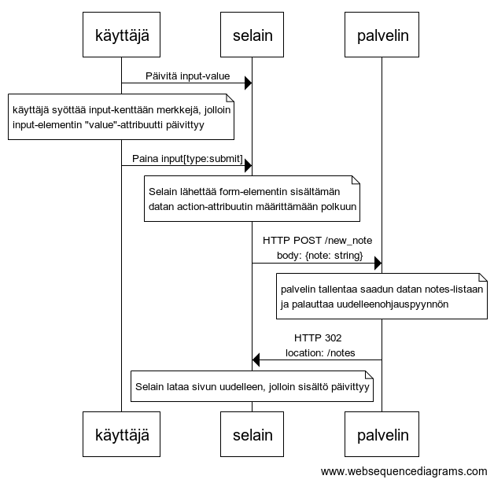

# Osa0

Osa0 tehtävät.

Diagrammit luotu [websequencediagrams](https://www.websequencediagrams.com/).

## 0.4: uusi muistiinpano



<details>
<summary>Tekstinä</summary>

```sh
käyttäjä->selain: Päivitä input-value

note over käyttäjä:
käyttäjä syöttää input-kenttään merkkejä, jolloin
input-elementin "value"-attribuutti päivittyy
end note

käyttäjä->selain: Paina input[type:submit]

note over selain:
Selain lähettää form-elementin sisältämän
datan action-attribuutin määrittämään polkuun
end note

selain->palvelin: HTTP POST /new_note \n body: {note: string}

note over palvelin:
palvelin tallentaa saadun datan notes-listaan
ja palauttaa uudelleenohjauspyynnön
end note

palvelin->selain: HTTP 302 \n location: /notes

note over selain:
Selain lataa sivun uudelleen, jolloin sisältö päivittyy
end note
```

</details>

## 0.5: Single Page App


<details>
<summary>Tekstinä</summary>

```sh
selain->palvelin: HTTP GET https://studies.cs.helsinki.fi/exampleapp/spa
palvelin-->selain: HTML-koodi
selain->palvelin: HTTP GET https://studies.cs.helsinki.fi/exampleapp/main.css
palvelin-->selain: main.css
selain->palvelin: HTTP GET https://studies.cs.helsinki.fi/exampleapp/spa.js
palvelin-->selain: spa.js
note over selain
Selain ajaa haetun scriptin
(luo muuttujat ja funktiot sekä
kutsuu data.json endpointtia)
end note
selain->palvelin: HTTP GET https://studies.cs.helsinki.fi/exampleapp/data.json
palvelin-->selain: data.json
note over selain
onreadystatechange -tapahtuman kuuntelija
säilöö haetun datan notes-muuttujaan ja
luo uudet elementit DOM:iin
end note
selain->selain: Luo haettu data DOM:iin
```

</details>

## 0.6: Uusi muistiinpano


<details>
<summary>Tekstinä</summary>

```sh
käyttäjä->selain: Päivitä input-value

note over käyttäjä:
käyttäjä syöttää input-kenttään merkkejä, jolloin
input-elementin "value"-attribuutti päivittyy
end note

käyttäjä->selain: Paina input[type:submit]

note over selain:
\#note_form:in onSubmit-tapahtumankuuntelija
triggeröityy ja luo objektin käyttäen
formin sisällä olevan input-elementin arvoa
ja lisää sen notes-listaan
end note

selain->selain: redrawNotes

note over selain:
redrawNotes manipuloi DOM:ia luomalla
notes-listan uudelleen päivitetyillä arvoilla
end note

note over selain:
selain lähettää luodun noten palvelimelle
end note

selain->palvelin: HTTP POST /ecampleapp/new_note_spa \n body: {content: string, date: Date}

note over palvelin:
Palvelin validoi ja formatoi
pyynnön sisällön
end note

alt uusi note ei läpäise validointia
palvelin->selain: status code 400
else uusi note läpäisee validoinnin
palvelin->palvelin: lisää note listaan
palvelin->selain: status code 201 \n body: {message: "note created"}
end
```

</details>
